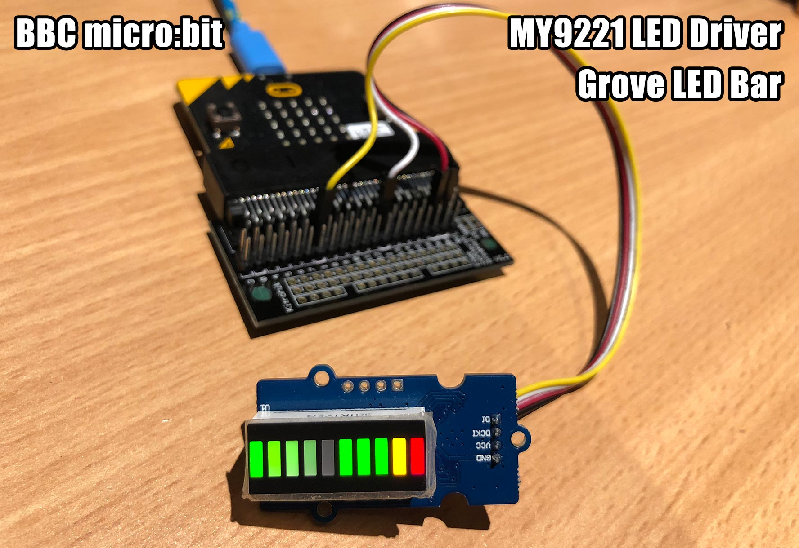

# BBC micro:bit MicroPython MY9221

A micro:bit MicroPython library for 10 segment LED bar graph modules using the MY9221 LED driver.

For example, the [Grove - LED Bar module](http://wiki.seeed.cc/Grove-LED_Bar/)



## Installation

* Install MicroPython for micro:bit by either compiling from [source](https://github.com/bbcmicrobit/micropython) or using one of my [precompiled firmwares](https://github.com/mcauser/microbit-tm1637/tree/master/firmware)
* Install [ufs](https://github.com/ntoll/microfs) to upload .py scripts
* Copy `my9221.py` and one of the example `main.py` scripts to the micro:bit
* Reset to run `main.py` on boot.

# Examples

```python
from microbit import *
from my9221 import MY9221
ledbar = MY9221(di=pin1, dcki=pin2, reverse=False)

# all LEDS on, full brightness
ledbar.level(10)

# four LEDS on, half brightness
ledbar.level(4, 0x0F)

# first and last LED on
ledbar.bits(0b1000000001)
ledbar.bits(0x201)
ledbar.bits(513)

# alternating LEDs
ledbar.bits(0b0101010101)
ledbar.bits(0b1010101010)

# fade out LEDs
buf = bytearray([0,1,3,7,15,31,63,127,255,255])
ledbar.bytes(buf)

# reverse orientation, first LED is green
ledbar.reverse(True)
ledbar.level(1)

# normal orientation, first LED is red
ledbar.reverse(False)
ledbar.level(1)
```

For more detailed examples, see /examples.

# Methods

Get or set the orientation.
The red LED normally position 1, and when reversed is position 10.
Once orientation has been set, all other methods respect the order.
```
reverse(val=None)
```

Illuminate a number of LEDs at a specific brightness.
A value of 5 would light half of the display.
```
level(val, brightness=255)
```

Illuminate LEDs, one bit per LED at a specific brightness.
Value can be 0-1023.
```
bits(val, brightness=255)
```

Use a bytearray, one byte per LED, to specify individual brightness for each LED.
```
bytes(buf)
```

## Parts

* [BBC micro:bit](https://tronixlabs.com.au/bbc-micro-bit/bbc-micro-bit-board-only-retail-pack-australia/) $24.95 AUD
* [Edge Connector Breakout Board](https://tronixlabs.com.au/bbc-micro-bit/edge-connector-breakout-board-for-bbc-micro-bit-australia/) $11.95 AUD
* [Grove LED Bar](https://www.seeedstudio.com/Grove-LED-Bar-v2.0-p-2474.html) $3.90 USD
* [Grove Male Jumper Cable](https://www.seeedstudio.com/Grove-4-pin-Male-Jumper-to-Grove-4-pin-Conversion-Cable-%285-PCs-per-Pack%29-p-1565.html) $2.90 USD

## Connections

micro:bit | Grove LED Bar
--------- | ---------------
Pin 1     | DI (yellow)
Pin 2     | DCKI (white)
3V3       | VCC (red)
GND       | GND (black)

An edge connector breakout board comes in handy here.

You're welcome to change the data and clock pins to something else - just update `MY9221(di=pin1, dcki=pin2)` in your `main.py`

## Links

* [BBC micro:bit](http://microbit.org/)
* [MicroPython for the BBC micro:bit](https://github.com/bbcmicrobit/micropython)
* [Kitronik Edge Connector Breakout Board](https://www.https://www.kitronik.co.uk/5601b-edge-connector-breakout-board-for-bbc-microbit-pre-built.html.co.uk/5601b-edge-connector-breakout-board-for-bbc-microbit-pre-built.html)
* [Grove LED Bar Wiki Page](http://wiki.seeed.cc/Grove-LED_Bar/)
* [micropython.org](http://micropython.org)
* [micro:bit on the MicroPython forum](https://forum.micropython.org/viewforum.php?f=17)
* [microfs](https://github.com/ntoll/microfs)
* [MY9221 datasheet](https://raw.githubusercontent.com/SeeedDocument/Grove-LED_Bar/master/res/MY9221_DS_1.0.pdf)
* [My Semi MY9221 product page](http://www.my-semi.com/content/products/product_mean.aspx?id=9)
* [MicroPython MY9221](https://github.com/mcauser/micropython-my9221)

## License

Licensed under the [MIT License](http://opensource.org/licenses/MIT).
